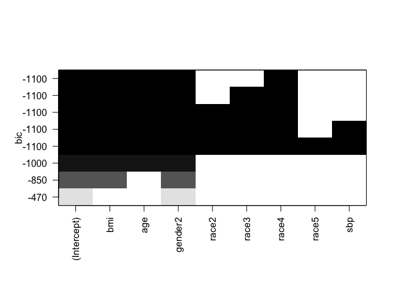

Linear Regression: A Revisit
================
Lin Yang

``` r
library(RNHANES)
library(tidyverse)
library(summarytools)
library(leaps)
```

# Data

In this example, we assess the association between high density
lipoprotein (HDL) cholesterol and body mass index, blood pressure, and
other demographic factors (age, gender, race) using the NHANES data
(<https://wwwn.cdc.gov/nchs/nhanes/ContinuousNhanes/Default.aspx?BeginYear=2001>).
The data can be downloaded using functions in the package `RNHANES`.

``` r
dat <- nhanes_load_data(file_name = "l13_B", year = "2001-2002")

dat = dat %>% 
  left_join(nhanes_load_data("BMX_B", "2001-2002"), by="SEQN") %>%
  left_join(nhanes_load_data("BPX_B", "2001-2002"), by="SEQN") %>%
  left_join(nhanes_load_data("DEMO_B", "2001-2002"), by="SEQN")

dat = dat %>% 
  select(SEQN, RIAGENDR, RIDRETH1, RIDAGEYR, BMXBMI, BPXSY1, LBDHDL) %>%
  mutate(RIAGENDR = as_factor(RIAGENDR), RIDRETH1 = as_factor(RIDRETH1))

colnames(dat) <- c("ID", "gender", "race", "age", "bmi", "sbp", "hdl")

dat <- na.omit(dat)
```

Summary statistics of the predictors and the response:

``` r
st_options(plain.ascii = FALSE,
           style = 'rmarkdown',
           dfSummary.silent = TRUE,
           footnote = NA,
           subtitle.emphasis = FALSE)
summary <- dfSummary(dat[, -1])
```

# Multiple linear regression: a small experiment

``` r
fit1 <- lm(hdl ~ bmi + age + gender + race + sbp, data = dat)
fit2 <- lm(bmi ~ age + gender + race + sbp, data = dat)
#residuals of fit2
r2 <- fit2$residuals
fit3 <- lm(hdl ~ r2, data = dat)
coef(fit1)['bmi']
```

       bmi 

-0.6649902

``` r
coef(fit3)['r2']
```

        r2 

-0.6649902

# Prediction intercal vs. confidence interval

``` r
newdata <- dat[1, ]
predict(fit1, newdata, interval = 'confidence')
```

       fit      lwr      upr

1 44.48379 43.83743 45.13016

``` r
predict(fit1, newdata, interval = 'predict')
```

       fit      lwr      upr

1 44.48379 18.50864 70.45895

# Best subset model selection

``` r
regsubsetsObj <- regsubsets(hdl ~ bmi + age + gender + race + sbp, data = dat,
                            method = 'exhaustive', nbest = 1)
plot(regsubsetsObj, scale = 'bic')
```

<!-- -->

``` r
summary(regsubsetsObj)
```

Subset selection object Call: regsubsets.formula(hdl \~ bmi + age +
gender + race + sbp, data = dat, method = “exhaustive”, nbest = 1) 8
Variables (and intercept) Forced in Forced out bmi FALSE FALSE age FALSE
FALSE gender2 FALSE FALSE race2 FALSE FALSE race3 FALSE FALSE race4
FALSE FALSE race5 FALSE FALSE sbp FALSE FALSE 1 subsets of each size up
to 8 Selection Algorithm: exhaustive bmi age gender2 race2 race3 race4
race5 sbp 1 ( 1 ) " " " " “*" " " " " " " " " " " 2 ( 1 ) "*” " " “*" "
" " " " " " " " " 3 ( 1 ) "*” “*" "*” " " " " " " " " " " 4 ( 1 ) “*"
"*” “*" " " " " "*” " " " " 5 ( 1 ) “*" "*” “*" " " "*” “*" " " " " 6 (
1 ) "*” “*" "*” “*" "*” “*" " " " " 7 ( 1 ) "*” “*" "*” “*" "*” “*" " "
"*” 8 ( 1 ) “*" "*” “*" "*” “*" "*” “*" "*”
